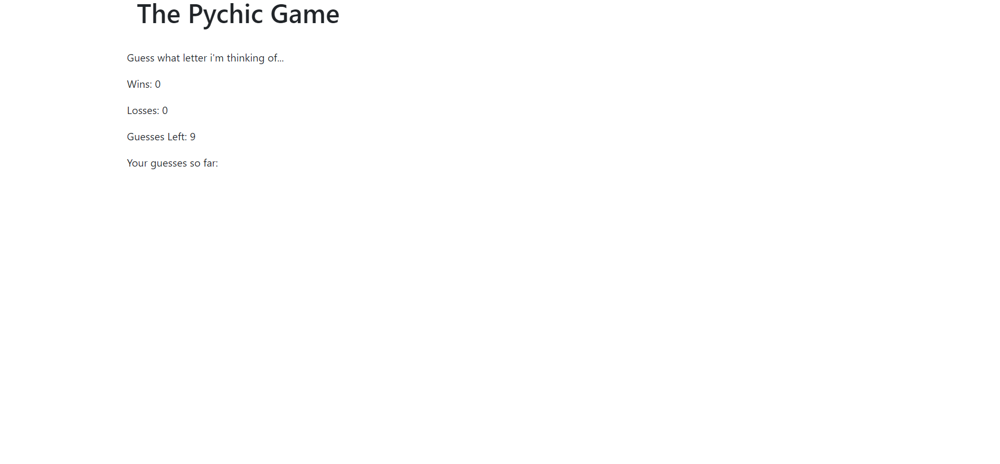

# Psychic-Game
This is a letter/character guessing program written using `HTML` and `JavaScript`.

### Description
* The program prompts user to enter a character [a-z] using keyboard and compares that character with a random character[a-z] generated by the computer.
* In each round user gets 9 chances to enter a character.
* If both the character's match, user's win count increments by 1 otherwise after all the guess attemps are exhauseted, loss count increments by 1.

### Live Demo
* Click [here ](https://pshegde123.github.io/Psychic-Game.github.io/) 

### Getting Started
(1)  Clone or download this repository.

(2) Change directory to psychic-game

(3) In your browser open file index.html

